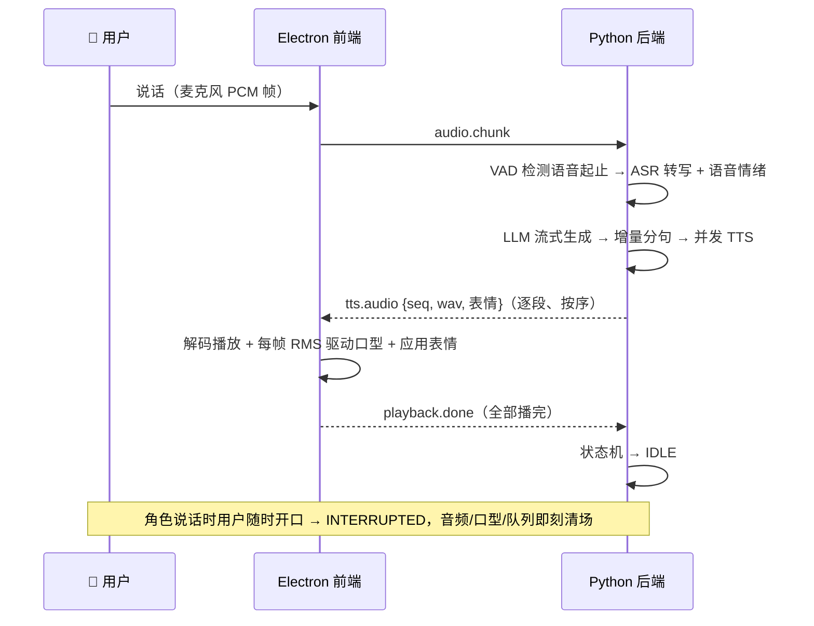

<div align="center">

# FlexiAvatar

**桌面 Live2D 数字人语音助手 — 全本地、可打断、3 秒克隆你的音色**

[](https://www.electronjs.org/)
[](https://react.dev/)
[](https://www.python.org/)
[](https://fastapi.tiangolo.com/)
[](https://www.amd.com/en/products/software/rocm.html)
[](https://www.live2d.com/)

对着桌面上的 Live2D 角色说话，她会带着表情、动着嘴回答你 —— 语音识别、大模型、语音合成全部跑在本地。

[核心特性](#-核心特性) · [架构](#-架构) · [快速开始](#-快速开始) · [配置](#-配置) · [FAQ](#-faq) · [路线图](#-路线图)

</div>

---

## ✨ 核心特性

- 🗣️ **全本地语音对话闭环** — VAD（Silero）→ ASR（SenseVoiceSmall）→ LLM（Ollama/qwen2.5）→ TTS（CosyVoice 2），无必需云依赖，数据不出机器
- 🎙️ **3 秒零样本音色克隆** — 基于 CosyVoice 2：一段 3-10 秒参考音频 + 对应文本，即可用任意音色说话；换音色 = 改两行配置，无需训练
- 💋 **引擎无关的口型同步** — 口型由播放音频的实时 RMS 音量驱动，与播放头同源（`el.currentTime`），不依赖任何 TTS 时间戳 → **随意更换 TTS 引擎，口型永不失步**
- 🎭 **情绪驱动表情** — 双路径融合：SenseVoice 直接从**语音**里听出情绪（ASR+SER 一个模型），文本关键词兜底；开心时微笑、难过时垂眉，空闲时还有自主小动作
- 🖐️ **随时打断** — 角色说话时直接开口即可打断，音频、口型、状态机三者同步归位，迟到的音频段按 `utteranceId` 丢弃
- ⚡ **流式低延迟管线** — LLM 流式输出 → 增量分句 → 有界并发合成 → 按序播放，第一句先响，不等全文
- 🔌 **适配器架构** — VAD/ASR/LLM/TTS 每个引擎一个适配器文件，`config.user.yaml` 一行切换；`edge-tts` 作为零 GPU 备选随时可退
- 🧰 **可扩展工具系统** — 往 `backend/tools/user_tools/` 丢一个 Python 文件即自动注册为 LLM 可调用工具
- 🐳 **Docker 一键部署** — Ollama + 后端全容器化，AMD ROCm GPU 开箱即用（含 CPU profile）

<!-- TODO: 在此放置演示 GIF / 截图
<div align="center"></div>
-->

## 🏗 架构

混合进程模型：Electron 负责渲染与交互，Python 负责 AI 管线，二者仅通过 WebSocket 通信。

```
┌────────────────────────── Electron ──────────────────────────┐
│  Main Process (Node)                                          │
│    ├─ BrowserWindow ──→ React 渲染进程                        │
│    │                     ├─ PixiJS + pixi-live2d-display      │
│    │                     │    (Live2D 模型/表情/口型/物理)      │
│    │                     └─ 播放泵: <audio> + RMS → LipSync    │
│    └─ python-bridge: 拉起后端 + 健康检查 + 自动重启             │
└──────────────────────────────┬────────────────────────────────┘
                        WebSocket (127.0.0.1:8765)
┌──────────────────────────────┴────────────────────────────────┐
│  Python Backend (FastAPI)                                      │
│    会话状态机: IDLE→LISTENING→PROCESSING→SPEAKING(→INTERRUPTED) │
│    AudioPipeline.respond():                                    │
│      LLM 流式 → 分句 → 有界并发 TTS → 按 seq 有序下发            │
│    ┌─────────┬──────────────────┬───────────────┬────────────┐ │
│    │ VAD     │ ASR              │ LLM           │ TTS        │ │
│    │ Silero  │ SenseVoice(主力) │ Ollama(本地)  │ CosyVoice2 │ │
│    │         │ Faster-Whisper   │ OpenAI 兼容   │ edge-tts   │ │
│    └─────────┴──────────────────┴───────────────┴────────────┘ │
└────────────────────────────────────────────────────────────────┘
```

一次语音对话的完整旅程：



**关键设计决策**

| 决策 | 为什么 |
|------|--------|
| 口型用 RMS 音量而非音素时间轴 | 所有免费/本地 TTS 都不输出字级时间戳，音素对齐永远是估算 → 结构性失步。RMS 与播放读同一份数据，物理上无法失步 |
| 重模型进程单例 + 启动预热 | 多窗口/重连不重复加载 20s+ 的模型；首句响应从 25s 降到 ~6s |
| WS 消息处理器一律 `create_task` | `playback.done` 只能从接收循环读出，在循环里同步等待 = 自死锁（血泪教训，详见 [postmortem](docs/live2d-fps-collapse-postmortem.md)） |
| 表情每帧重写（pixi 回滚语义） | pixi-live2d-display 在每帧 update 末尾回滚参数，一次性写入不可见 |

## 🚀 快速开始

### 方式一：Docker（推荐）

前置：Linux + Docker + AMD GPU（ROCm，`/dev/kfd` `/dev/dri`）；NVIDIA/纯 CPU 见下方说明。

```bash
git clone https://github.com/Jjas0n507/FlexiAvatar.git
cd FlexiAvatar

# 构建并启动（Ollama + 后端）
docker compose --profile gpu build backend
docker compose --profile gpu up -d

# 等待就绪
curl http://127.0.0.1:8765/health

# 启动 Electron 前端（连接 Docker 后端）
bash scripts/dev-frontend.sh
```

或一键脚本：`bash scripts/start-docker.sh`

> ⚠️ **前端必须用 `scripts/dev-frontend.sh`（或任意非 snap 终端）启动**：snap 版 VSCode 集成终端会向 Electron 泄漏旧系统库路径，导致 GPU 加速失效、帧率骤降。
>
> 💡 纯 CPU 跑后端：`docker compose --profile cpu up -d`（TTS 建议切回 `edge-tts`，本地大模型推理速度取决于 CPU）。

### 方式二：本地开发

```bash
# 后端（Python 3.10+）
python3 -m virtualenv .venv && source .venv/bin/activate
pip install -r backend/requirements.txt        # PyAudio 需要 portaudio19-dev
python -m uvicorn backend.main:app --host 127.0.0.1 --port 8765

# 前端（Node 20+）
cd frontend
npm install
npm run electron:dev
```

首次运行会自动下载模型（国内网络友好：HF 走 `hf-mirror.com`，SenseVoice/CosyVoice 走 ModelScope），缓存于 `resources/models/`。

## ⚙️ 配置

配置三层合并：`config.default.yaml` → `config.user.yaml`（gitignored，个人覆盖）→ `.env` 环境变量插值。

### 引擎矩阵

| 模块 | 引擎 | 说明 |
|------|------|------|
| VAD | `silero` | 512 samples/帧（32ms@16kHz），毫秒级响应 |
| ASR | `funasr` ⭐ | SenseVoiceSmall，**识别+情绪一个模型**，非自回归 ~70ms/10s 音频 |
| ASR | `whisper` | Faster-Whisper（CTranslate2），多语种备选 |
| LLM | `ollama` ⭐ | 本地推理，默认 qwen2.5:7b，可换任意 Ollama 模型 |
| LLM | `openai` | 任何 OpenAI 兼容 API（`.env` 配 key） |
| TTS | `cosyvoice2` ⭐ | 零样本音色克隆，WAV 直传，ROCm fp16 |
| TTS | `edge-tts` | 微软在线合成，零 GPU、零下载，快但音色固定 |

### 克隆你的音色（30 秒上手）

1. 录一段 **3-10 秒**、安静环境下的清晰人声，存为 `resources/models/voices/my_voice.wav`
2. 在 `backend/config.user.yaml` 写入：

```yaml
tts:
  engine: "cosyvoice2"
  cosyvoice2:
    ref_audio: "resources/models/voices/my_voice.wav"
    ref_text: "这段音频里说的每一个字，逐字写在这里。"
```

3. 重启后端。角色开口即是你的音色。

> 📎 参考音频越贴近"正常语速、无背景音"，克隆效果越好；`ref_text` 必须与音频内容逐字一致。

### 自定义 Live2D 模型

将 Cubism 3/4 模型放入 `frontend/public/live2d/<模型名>/`，通过 `model_profile.yaml` 声明表情/动作/口型参数映射（前后端共享同一契约），无需改代码。

### 扩展工具

在 `backend/tools/user_tools/` 新建文件即热注册：

```python
from backend.tools.base import Tool
from pydantic import BaseModel

class Params(BaseModel):
    city: str

class WeatherTool(Tool):
    name = "weather"
    description = "查询城市天气"
    def parameters_model(self): return Params
    async def execute(self, city: str): return f"{city}：晴，26°C"
```

## ❓ FAQ

<details>
<summary><b>句与句之间偶尔有 1-5 秒静默？</b></summary>

本地 TTS 在短句上 RTF（合成耗时/音频时长）约 1.5，边播边追时会出现段间等待 —— 这是算力现实而非丢句，状态栏会保持"说话中"。缓解：调大 `tts.streaming.min_segment_length`（段更长摊薄开销，代价是首句稍慢）；或切 `edge-tts`（无静默但音色固定）。终极方案（流式分块合成）在路线图中。
</details>

<details>
<summary><b>Electron 帧率很低 / 只有软件渲染？</b></summary>

大概率是从 snap 版 VSCode 的集成终端启动的 —— 它会泄漏 core20 库路径污染 Electron GPU 进程。请始终用 `scripts/dev-frontend.sh` 或系统自带终端启动。
</details>

<details>
<summary><b>容器重建后 CosyVoice 报未安装？</b></summary>

CosyVoice 依赖目前在容器内安装，`docker restart` 幸存但 `docker compose up --force-recreate` 会丢失（Dockerfile 固化在路线图中）。重建后需重新执行容器内安装步骤（见 `backend/tts/cosyvoice_adapter.py` 头部注释）。
</details>

<details>
<summary><b>模型下载太慢？</b></summary>

已内置国内镜像策略：HuggingFace 模型走 `hf-mirror.com`（`HF_ENDPOINT`），SenseVoice/CosyVoice 走 ModelScope 直连。全部模型缓存在 `resources/models/`，删除即可重下。
</details>

<details>
<summary><b>为什么坚持 512 samples 的 VAD 帧？</b></summary>

Silero VAD 的硬性约束（32ms @ 16kHz），喂其他尺寸会静默产出垃圾结果。管线中所有音频帧切分都以此为准。
</details>

## 🗺 路线图

- [ ] CosyVoice `stream=True` 分块流式合成（消除段间静默 + 进一步降低首响延迟）
- [ ] Dockerfile 固化 CosyVoice 依赖层（容器重建零手工步骤）
- [ ] 麦克风采集迁移 `AudioWorklet`（替换已废弃的 ScriptProcessorNode）
- [ ] 设置面板 UI（引擎/音色/模型切换免改文件）
- [ ] LLM 工具调用端到端 + 内置工具集（时间/天气/计算/搜索）
- [ ] 对话气泡、系统托盘、全局快捷键、打包分发

完整状态见 [STATUS.md](STATUS.md) / [NEXT.md](NEXT.md) / [TODO.md](TODO.md)。

## 🛠 开发

```bash
# 后端测试（单元测试要求后端未运行；Docker 环境可 docker cp 进容器跑）
python -m pytest tests/ -v

# 前端
cd frontend
npm run lint    # oxlint
npm run build   # tsc + vite
```

- 分支规范：`phase{N}-{name}`，从 `master` 拉出，提交前跑测试
- 排查利器：dev 模式 Electron 自带 CDP 调试口 `127.0.0.1:9223`，renderer 暴露 `window.__wsClient`，可远程驱动对话、抓全链路日志
- 深度阅读：[Live2D 帧率坍塌与静音假超时事故复盘](docs/live2d-fps-collapse-postmortem.md) —— 六层错误理论、双根因定案与三个陪葬 bug 的完整取证过程

## 🙏 致谢

本项目站在这些出色的开源工作之上：

[CosyVoice](https://github.com/FunAudioLLM/CosyVoice) · [FunASR / SenseVoice](https://github.com/modelscope/FunASR) · [Silero VAD](https://github.com/snakers4/silero-vad) · [Faster-Whisper](https://github.com/SYSTRAN/faster-whisper) · [Ollama](https://github.com/ollama/ollama) / [Qwen](https://github.com/QwenLM/Qwen2.5) · [edge-tts](https://github.com/rany2/edge-tts) · [pixi-live2d-display](https://github.com/guansss/pixi-live2d-display) · [PixiJS](https://pixijs.com/) · [FastAPI](https://fastapi.tiangolo.com/)

## 📄 License

代码开源协议待定。注意：

- **Live2D Cubism Core** 受 [Live2D 专有许可](https://www.live2d.com/eula/live2d-proprietary-software-license-agreement_cn.html)约束
- 仓库内示例 Live2D 模型版权归原作者所有，仅供学习演示，请勿二次分发或商用
- 各 AI 模型（SenseVoice/CosyVoice/Qwen 等）遵循其各自的开源协议
